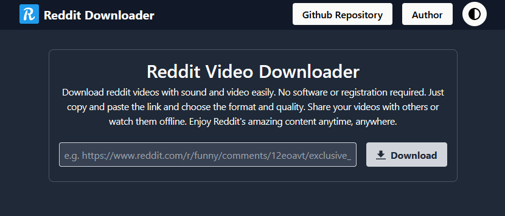
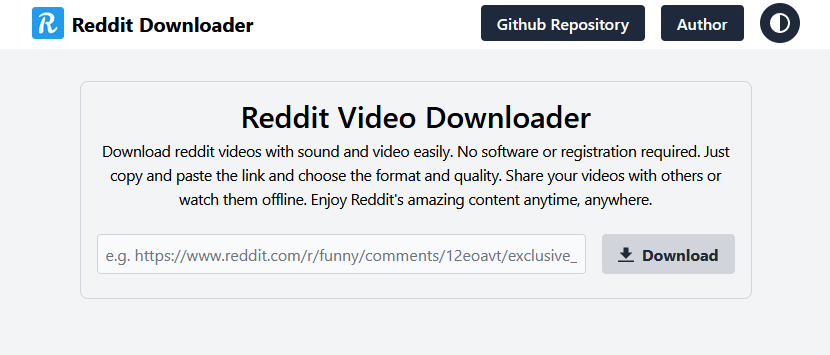
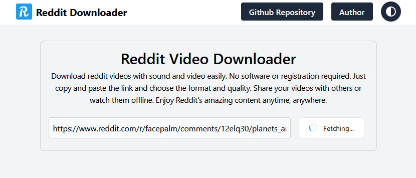
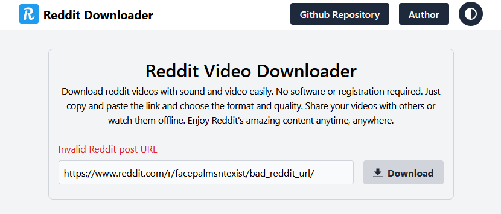

# Reddit Videos Downloader

Download reddit videos with audio!!

## Description

Reddit Videos Downloader is a tool that allows you to download any video from Reddit with audio and save it to your device . Whether you want to watch funny, educational, or inspirational videos offline, Reddit Videos Downloader can help you do that easily and quickly.

## Getting Started

### Website Preview









## Installation & Running

- FFMPEG installation

You can get the latest ffmpeg from their official website here [ffmpeg.org](https://ffmpeg.org/download.html) .

***NOTE: `FFMPEG` is required for the app to work unless you are using Docker then the container will install and you can skip this step.***

- Clone the repository or download the zip file and extract it

```bash
git clone https://github.com/riad-azz/reddit-videos-downloader.git
```

- Installing dependencies

```bash
cd reddit-videos-downloader
```

```bash
pip install -r requirements.txt
```

- Running the app for Development & Testing

```bash
python main.py -port 5000

python main.py -debug true -port 5000
```

- Running the app for Production

```bash
# Running the app with Docker

# Build & Run container
docker-compose up -d -build

# Run container
docker-compose up -d
```

```bash
# On Linux you can just run gunicorn
gunicorn --bind 0.0.0.0:5000 wsgi.wsgi:app
```

- NPM Utils

```bash
# Install dependencies
npm install
```

```bash
# Styling with Tailwind CSS Watch mode
npm start

# Format templates html
npm pretty
```

## License

This project is licensed under the [MIT] License - see the LICENSE.md file for details
